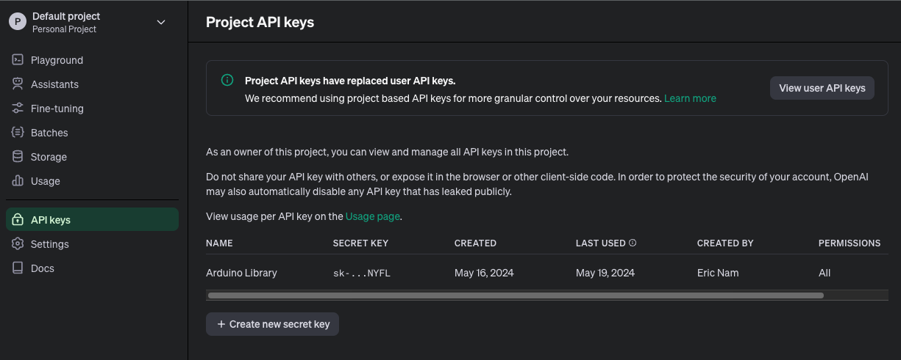

# ChatGPT Client For Arduino

This library helps to use ChatGPT in Arduino environment. There are many features, but currently, only the Create chat completion part is implemented.
Since this uses an official API, you must obtain an API Key from openAI to use it.

## Authentication

The OpenAI API uses API keys for authentication. Visit your API Keys page to retrieve the API key you'll use in your requests.

First, get your SECRET KEY issued here.
https://platform.openai.com/account/api-keys


## Installation

### Using Arduino Library Manager

From Arduino IDE, go to menu *Sketch -> Include Library -> Manage Libraries...*
In Library Manager Window, search *"ChatGPT"* in the search form then select *"ChatGPT_Client"*
Click *"Install"* button.

### Manual installation

Download zip file from this repository by selecting the green *"Code"* dropdown at the top of repository, select *"Download ZIP"*
From Arduino IDE, select menu *Sketch -> Include Library -> Add .ZIP Library...*

Or use git:
 ```
 cd ~/arduino/libraries/
 gh repo clone 0015/ChatGPT_Client_For_Arduino
 ```

Then you should see the examples and be able to include the library in your projects with:

```
 #include <ChatGPT.hpp>
```

## Usage

Here's a minimal example:
```
if (chat_gpt.simple_message("gpt-3.5-turbo-0301", "user", "Planning a 3-day trip to San Diego", result)) {
    Serial.println("===OK===");
    Serial.println(result);
} else {
    Serial.println("===ERROR===");
    Serial.println(result);
}
```

Result
```
As an AI language model, I don't have personal preferences or can make travel arrangements but here's an outline of what one can experience in San Diego in a 3-day trip:

Day 1:
- Visit Balboa Park, a 1,200-acre cultural oasis with gardens, museums, theaters, and the famous San Diego Zoo.
- Check out the Gaslamp Quarter, a historic district filled with Victorian-era buildings, trendy restaurants, bars, and shops.
- Take in the stunning panoramic views of the city from Cabrillo National Monument, located on the southern tip of the Point Loma Peninsula.

Day 2:
- Spend the day at the beach. San Diego has many beautiful beaches, including La Jolla Cove, Coronado Beach, and Mission Beach.
- Visit the USS Midway Museum, where visitors can board the decommissioned aircraft carrier and explore its 60 exhibits and 29 restored aircraft.
- Check out the Maritime Museum of San Diego, where you can tour historic ships and learn about maritime history.

Day 3:
- Explore Old Town San Diego, known as the birthplace of California, with its preserved adobe buildings, museums, and shops.
- Go on a whale watching excursion from the San Diego Harbor.
- Visit the San Diego Botanic Garden, which boasts 37 acres of gardens and includes a tropical rainforest, desert, and bamboo groves.

Overall, San Diego offers a wide range of attractions and activities for all tastes and ages.
```

# Updates 

 - v0.1.1
    - Added ESP8266 Example

 - v0.1.0
    - Only Support Chat completion yet
    - Model, only gpt-3.5-turbo and gpt-3.5-turbo-0301 are supported

# License

 This software is written by Eric Nam and is licensed under The MIT License. Check License file for more information.    